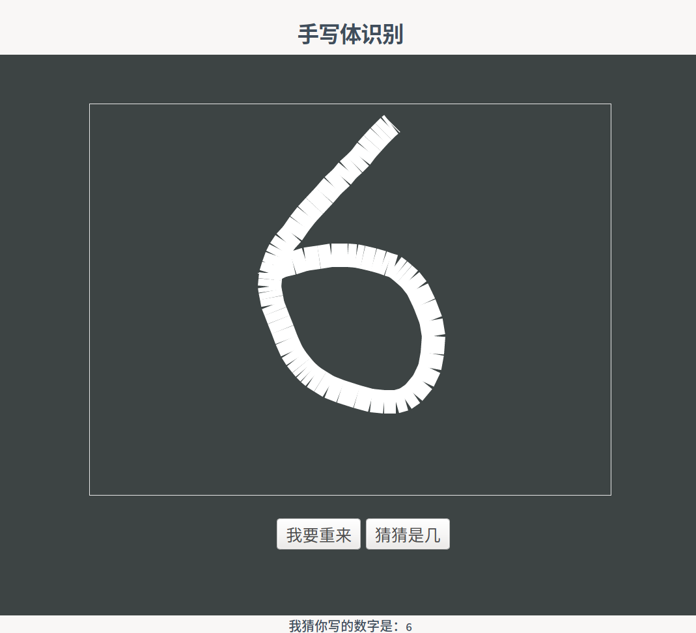

# DigitRecognitionService
# 简介

该项目为在线手写数字识别服务。模型采用keras构建，通过docker部署在云服务器上提供服务。

# 在线体验

地址：http://139.9.131.190:5001/



# 特性

- 手写数字项目通过docker实现对外提供服务
- 采用docker-compose实现快速部署

# 本地部署

将项目部署到本地或云端提供以下两种方式：

- 本地python服务
- 通过docker部署

## 目录结构

- modelTrain：包含深度学习模型的相关内容，在这里你可以更换数据集或更改模型结构用于定制化服务。
- flaskService：将训练好的深度学习模型加载并通过Flask框架对外提供服务，默认端口为5000。
  - model.h5：为深度学习训练好的模型。
  - static、templates：静态资源用于显示前台界面。
- dockerFlaskService：将Flask写好的服务包装为docker镜像。
  - main.py：与flaskService中的main.py相同。
  - model.h5：为深度学习训练好的模型。
  - Dockerfile：通过此文件构建Docker镜像。
  - requirements.txt：构建Dokcer镜像需要的依赖，在构建Docker镜像时会根据此文件安装依赖。
  - docker-compose.yml：通过此文件，docker-compose快速对外提供服务。

## 本地python服务

### 获取代码

```bash
https://github.com/Knowledge-Precipitation-Tribe/DigitRecognitionService.git
```

### 环境要求

- keras
- flask

### 启动服务

```bash
cd flaskService
python main.py
```

默认端口映射到`5001`，通过浏览器输入`127.0.0.1:5001/`即可查看到显示效果。

## 通过docker部署

### 简便方式

编写`docker-compoes.yml`文件

```yml
version: "3"

services:

    flaskservice:
        image: superssssss/flaskkeras
        ports: 
            - "5001:5001"
```

然后在终端输入命令

```bash
docker-compose up -d
```

默认端口映射到`5001`，通过浏览器输入`127.0.0.1:5001/`即可查看到显示效果。

> 直接通过docker run也是可以的

### 自构建镜像方式

```bash
cd dockerFlaskService
```

然后在终端输入以下命令

```bash
docker-compose up -d
```

之后会执行镜像的构建过程，构建成功之后，通过浏览器输入`127.0.0.1:5001/`即可查看到显示效果。

> 如果部署到云服务器修改为对应的云服务器(修改安全组)ip即可。

# 项目模块

## 深度学习模型

这里我们使用一个简单的两层卷积作为手写数字识别的深度学习基础模型，该模型在mnist数据集上测试准确率维98%。

```
_________________________________________________________________
Layer (type)                 Output Shape              Param #   
=================================================================
conv2d_1 (Conv2D)            (None, 24, 24, 8)         208       
_________________________________________________________________
max_pooling2d_1 (MaxPooling2 (None, 12, 12, 8)         0         
_________________________________________________________________
conv2d_2 (Conv2D)            (None, 8, 8, 16)          3216      
_________________________________________________________________
max_pooling2d_2 (MaxPooling2 (None, 4, 4, 16)          0         
_________________________________________________________________
flatten_1 (Flatten)          (None, 256)               0         
_________________________________________________________________
dense_1 (Dense)              (None, 32)                8224      
_________________________________________________________________
batch_normalization_1 (Batch (None, 32)                128       
_________________________________________________________________
dense_2 (Dense)              (None, 10)                330       
=================================================================
Total params: 12,106
Trainable params: 12,042
Non-trainable params: 64
_________________________________________________________________

test loss: 0.04292399436235428, test accuracy: 0.9868000149726868
```

## Flask框架

在Flask框架下实现模型的加载与数据的预处理，数据处理成功后通过模型预测结果。

## Docker

通过Dockerfile实现镜像的构建，并通过docker-compose启动。

# 存在的问题

- 不能识别特别边缘的数字
- 有些书写方式会造成错误识别
- 只能识别0-9🤣

# 新版本

未来的新版本中可能会将多种服务，例如，手写数字识别，文本生成，图像识别，目标检测等进行集成，并加入负载均衡器，服务监控，高并发服务等。也有可能加入在线学习，增强模型的范化能力。未来项目整体会采用微服务架构。

# 附录

- docker安装：[https://docs.docker.com/](https://docs.docker.com/)
- docker-compose安装：[https://docs.docker.com/compose/install/](https://docs.docker.com/compose/install/)

# License

[MIT](https://github.com/Knowledge-Precipitation-Tribe/DigitRecognitionService/blob/master/LICENSE)

Copyright (c) 2020 Knowledge-Precipitation-Tribe